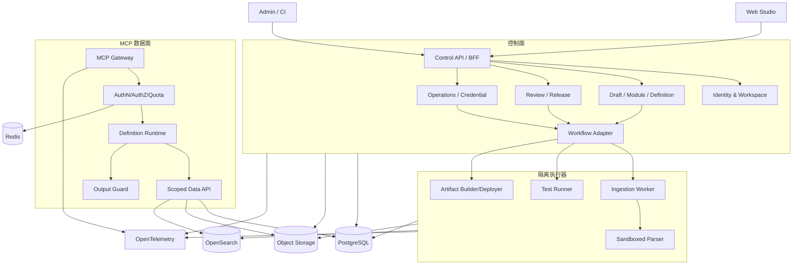

# 模块化 MCP 构建套件技术开发方案

> 版本：V1.0  
> 日期：2026-09-15  
> 状态：技术专家评审稿  
> 依据：PRD V1.0、用户操作流程 V1.0、UI 设计手册 V1.0  
> 范围：P0 完整闭环；P1 仅预留扩展点

---

## 1. 评审结论摘要

建议采用“模块化单体控制面 + 独立 MCP 数据面 + 隔离异步执行器”的架构。P0 不拆成大量微服务，先通过清晰的领域边界、独立包、数据库所有权和异步契约建立可拆分性；只有暴露公网、处理不可信文件、执行长任务或需要独立扩缩容的组件才独立部署。

核心技术决策：

1. `Service Definition` 是唯一运行事实，Draft 可编辑，Candidate 和 Published Version 不可变；
2. 预览、测试、审核和线上运行均消费同一份 canonical Definition 及其 SHA-256 摘要；
3. 模块采用声明式清单和平台审核的内置实现，P0 不运行用户脚本、任意容器或任意 SQL；
4. 所有访问都执行“认证 → 租户隔离 → 策略 → 配额 → 能力 → 数据范围 → 输出过滤”，任一保护组件异常均关闭式拒绝；
5. 上传、解析、索引、测试和部署使用持久化工作流，业务写入通过幂等键和事务外盒避免重复结果；
6. PostgreSQL 保存控制面事实，兼用行级安全作纵深防御；对象存储保存原始文件和不可变制品；OpenSearch 保存可重建索引；Redis 只保存可丢失缓存、短锁和配额桶；
7. 所有 Secret 使用 KMS/Vault 信封加密，业务数据库只保存密文和摘要，Secret 明文不进入日志、事件、测试报告或前端状态；
8. P0 先交付上传 TXT/PDF 到远程只读 MCP 的纵向切片，再扩充七格式、连接器、OAuth 和运营闭环。

## 2. 目标、边界与假设

### 2.1 技术目标

- 30 分钟内从上传资料到可连接的开发环境 MCP；
- 未授权、越界、超配额和撤权请求正确拦截率 100%；
- 发布版本不发生数据、模块、Schema 或策略静默漂移；
- 后台任务至少一次执行、业务结果恰好一次生效；
- 普通控制面 API P95 不高于 800 ms，搜索 P95 不高于 2 s，按段读取 P95 不高于 3 s；
- 月度服务可用性目标 99.9%；
- 全链路可由 `requestId`、`jobId`、`traceId` 关联，同时不记录正文和凭证。

### 2.2 P0 边界

P0 支持只读资料服务、只读 HTTP API、对象存储和受控数据库表/视图；支持 Tools、Resources、Prompts、API Key、OAuth、审核、部署、版本和运营。P0 明确不支持写数据库、金融交易执行、删除外部数据、整库导出、原文件下载、任意 SQL、用户脚本和用户容器。

项目现有材料使用“模块化 MCP 构建套件”。本文中的“套件”均指该构建与运营平台，不包含证券、支付或其他资金交易能力。

### 2.3 待架构委员会确认的决策

| 决策 | 本方案默认值 | 未确认时处理 |
| --- | --- | --- |
| 部署形态 | SaaS 优先，组件支持私有化 Helm 部署 | 不设计跨云控制面 |
| 首期身份源 | OIDC 企业身份 + 本地开发身份模拟器 | 生产禁止模拟器 |
| 数据驻留 | Workspace 固定 Region，跨区禁止 | 单 Region 先行 |
| 搜索引擎 | OpenSearch；接口隔离以便替换 | 不启用向量检索 |
| 工作流引擎 | Temporal | 不以进程内队列替代 |
| 策略引擎 | Cedar/OPA 二选一；本文以 OPA 接口描述 | 冻结 `PolicyDecision` 契约 |
| 模块执行格式 | 内置可信实现 + 签名声明清单 | 用户自定义模块保持关闭 |
| 审核模式 | 项目审核 + 高风险平台复核 | 无审核者时不能发生产 |
| 保留期 | 配置化，审计默认长于普通日志 | 不硬编码到业务代码 |

## 3. 架构原则

1. **事实不可变**：已提交和已发布对象只追加，不原地修改。
2. **控制面与数据面分离**：管理操作故障不应中断已有健康 MCP 调用；MCP 数据面不能访问控制面写接口。
3. **最小权限**：模块拿到的是受限上下文和数据访问接口，不拿生产 Secret、文件系统或任意网络。
4. **策略先于数据**：发现、列举、错误处理和调试均先鉴权，禁止通过存在性差异侧信道推测对象。
5. **确定性构建**：相同输入、模块版本和构建器版本产生相同 Definition 摘要。
6. **异步可恢复**：长任务有状态、阶段、进度、重试、取消和补偿，不依赖浏览器连接。
7. **可替换基础设施**：领域层只依赖端口，不直接依赖 OpenSearch、S3、OPA 或 Temporal SDK。
8. **可验证安全**：权限、范围、输出过滤和制品一致性必须有自动化负例。

## 4. 逻辑架构



### 4.1 部署单元

| 单元 | 责任 | 独立部署原因 |
| --- | --- | --- |
| `web` | 工作台、向导、运营页面 | 静态资源与 BFF 生命周期不同 |
| `control-api` | 控制面领域用例和外部 REST API | 强事务边界；P0 保持模块化单体 |
| `mcp-gateway` | MCP 初始化、发现、Tools/Resources/Prompts 与调用 | 公网入口、低延迟、独立扩缩容 |
| `workflow-worker` | 上传、处理、测试、部署流程编排 | 长任务、重试、可恢复 |
| `parser-worker` | 文件扫描后解析、规范化、切块 | 不可信输入隔离和资源限制 |
| `connector-worker` | HTTP、对象存储、数据库只读抽取 | 网络出口和 Secret 权限隔离 |
| `otel-collector` | traces、metrics、logs 汇聚与脱敏 | 统一治理可观测性 |

### 4.2 P0 不拆分的能力

Workspace、Project、Draft、Module Catalog、Definition、Review、Credential 和 Operations 在 `control-api` 内按包隔离，不独立成服务。它们共享强事务、开发团队和发布节奏；过早网络拆分会增加分布式事务、契约版本和本地开发成本。达到独立扩缩容、独立合规边界或团队独立所有权后再拆分。

## 5. 建议技术栈与仓库结构

### 5.1 技术栈

| 层 | 选择 | 说明 |
| --- | --- | --- |
| Web | TypeScript、React、Next.js、TanStack Query、React Hook Form、Zod | SSR/SPA 混合；表单与契约类型统一 |
| API/MCP | Node.js LTS、TypeScript、Fastify、官方 MCP TypeScript SDK | 单语言提升 P0 交付和代理可维护性 |
| 工作流 | Temporal TypeScript SDK | 持久化状态、重试、取消、信号和可观察性 |
| 数据 | PostgreSQL、Prisma 或 Kysely；迁移以 SQL 审核 | 强事务、JSONB、RLS、审计和 outbox |
| 搜索 | OpenSearch | 关键字检索、过滤、分页、可重建索引 |
| 缓存/限流 | Redis | 分布式令牌桶、短期缓存；不保存唯一事实 |
| 对象 | S3 API；本地 MinIO | 原始文件、规范化数据、报告、制品 |
| 策略 | OPA sidecar/service + 版本化 Rego bundle | 统一授权决策和决策原因；可替换 |
| Secret | 云 KMS + Secret Manager/Vault | 信封加密、轮换、审计 |
| 可观测 | OpenTelemetry、Prometheus、Grafana、Loki/兼容后端 | vendor-neutral telemetry |
| 部署 | Docker、Kubernetes、Helm、Terraform | SaaS/私有化共同制品 |
| 测试 | Vitest、Playwright、Testcontainers、k6、Schemathesis/自建契约测试 | 单元、集成、E2E、性能、安全 |

所有依赖必须通过 lockfile 和制品摘要固定；版本升级单独提交，不在功能工作包中顺手升级。

### 5.2 Monorepo 结构

```text
.
├── AGENTS.md
├── apps/
│   ├── web/
│   ├── control-api/
│   ├── mcp-gateway/
│   └── workers/
├── packages/
│   ├── contracts/          # OpenAPI、JSON Schema、事件、错误码
│   ├── domain/             # 纯领域模型与状态机
│   ├── database/           # schema、migration、repository
│   ├── authz/              # 身份上下文、策略端口与决策
│   ├── definition/         # canonicalize、compile、hash、diff
│   ├── module-sdk/         # 清单、配置 schema、生命周期
│   ├── module-builtins/    # P0 可信模块
│   ├── data-access/        # 范围受控的数据端口
│   ├── observability/
│   ├── test-fixtures/
│   └── ui/
├── infra/
│   ├── compose/
│   ├── helm/
│   ├── terraform/
│   └── policies/
├── docs/
│   ├── adr/
│   ├── api/
│   ├── threat-model/
│   └── runbooks/
├── scripts/
└── tests/
    ├── contract/
    ├── e2e/
    ├── performance/
    └── security/
```

依赖方向固定为：`apps -> application -> domain`，基础设施实现依赖领域端口；`domain` 禁止导入 Web、数据库、Temporal、OPA、Redis 或云 SDK。

## 6. 领域模型与数据设计

### 6.1 聚合及不变量

| 聚合 | 聚合根 | 关键不变量 |
| --- | --- | --- |
| 租户 | Workspace | Region 固定；跨 Workspace 引用禁止 |
| 项目 | Project | 环境、成员、数据和服务均属于一个 Workspace |
| 数据 | DataSource/DataVersion | 版本不可变；发布只引用完成且确认的数据版本 |
| 构建 | Draft | 乐观锁；可编辑；保存与步骤完成分离 |
| 模块 | ModuleVersion | 精确 SemVer、审核状态、制品摘要和签名 |
| 定义 | ServiceDefinition | canonical JSON 不可变；摘要唯一；引用精确版本 |
| 审核 | Candidate/Review | Candidate 冻结；意见定位 JSON Pointer |
| 发布 | ServiceVersion/Deployment | 运行摘要必须等于批准摘要 |
| 访问 | AccessPolicy/Credential | 凭证只证明主体；权限取各层交集 |
| 运行 | RequestTrace/UsageBucket | 不保存 Secret 或原文；计量幂等 |

### 6.2 主表

建议主键使用 UUIDv7；所有租户表携带 `workspace_id`，项目表再携带 `project_id`；时间统一 UTC，用户界面按 Workspace 时区显示。

```text
workspaces, workspace_members, projects, project_members
data_sources, data_source_secrets, data_versions, data_items, processing_jobs
modules, module_versions, module_dependencies, module_reviews
drafts, draft_revisions, service_definitions, definition_modules
candidates, review_rounds, review_comments, test_runs, test_cases
services, service_versions, deployments, deployment_events
access_policies, policy_versions, credentials, credential_rotations
request_traces, usage_events, quota_buckets, audit_events
outbox_events, idempotency_records
```

### 6.3 租户隔离

- API 层从受验证 token 构造 `ActorContext`，禁止接受客户端传入的 Workspace 作为可信身份；
- 每个数据库事务先设置 `app.workspace_id` 和 `app.actor_id`，RLS 以此过滤；
- Repository 方法仍显式携带 `workspaceId/projectId`，RLS 作为第二道防线；
- 对象键格式为 `region/workspace/project/dataVersion/...`，使用短期签名 URL，下载策略校验后生成；
- OpenSearch 文档强制包含 `workspaceId/projectId/dataVersionId`，查询构造器不可由客户端覆盖；
- Redis key 含环境和租户维度，避免配额串桶；
- 跨租户同名对象返回同一类 `NOT_FOUND_OR_FORBIDDEN`，不泄露存在性。

### 6.4 乐观锁和幂等

- Draft 使用 `revision`；更新必须携带 `If-Match`/revision，不匹配返回 `DRAFT_CONFLICT` 和可比较差异；
- 所有创建、重试、部署、计量写接口接受 `Idempotency-Key`；
- 幂等记录保存请求规范化摘要、结果引用和过期时间；同键异参拒绝；
- 工作流 activity 可重复执行，唯一约束保证 DataVersion、ServiceVersion、Deployment 和 UsageEvent 不重复；
- 状态变更与 outbox 写入同一事务，发布器至少一次投递，消费者去重。

## 7. 模块系统

### 7.1 模块类型

- `source`：定义规范化数据接口和来源能力；
- `capability`：产生 MCP Tool/Resource 行为；
- `output`：字段白名单、遮蔽、截断、引用和响应限制；
- `prompt`：仅编排已授权能力，不增加权限；
- 平台保护层不是可选模块，始终由 Gateway 执行。

### 7.2 模块清单

```json
{
  "id": "capability.search-documents",
  "version": "1.0.0",
  "type": "capability",
  "apiVersion": "studio.mcp/v1",
  "implementation": "builtin:search-documents@sha256:...",
  "requires": ["source.normalized-documents@^1"],
  "conflicts": ["source.unversioned-live-read"],
  "provides": ["tool.search_documents"],
  "configSchemaRef": "schemas/search-documents.config.json",
  "inputSchemaRef": "schemas/search-documents.input.json",
  "outputSchemaRef": "schemas/search-documents.output.json",
  "permissions": ["data:search"],
  "risk": "medium",
  "limits": {"maxResults": 10},
  "artifactDigest": "sha256:...",
  "signature": {"keyId": "platform-root-1", "value": "..."}
}
```

模块 resolver 执行精确版本解析、依赖闭包、循环检测、冲突检测、API 版本兼容、审核状态和签名验证。生产 Definition 只保存解析后的精确版本，不保存浮动范围。

### 7.3 P0 执行模型

P0 模块实现编译进受控运行时或以平台签名制品随版本部署。模块只能调用 `ScopedDataPort`、`PolicyContext` 和 `OutputGuard`，禁止直接使用网络、数据库连接和 Secret。P1 自定义模块如采用 WASI/微虚机，应另做威胁模型、能力授权、资源配额和供应链评审，不能直接沿用 P0 信任假设。

## 8. Service Definition 与构建

### 8.1 Definition 结构

```text
metadata: schemaVersion, serviceId, version, environment
identity: workspaceId, projectId
dataBindings[]: sourceId, dataVersionId, allowedScopes
modules[]: id, exactVersion, artifactDigest, normalizedConfig
capabilities: tools[], resources[], prompts[]
policy: policyVersionId, audience, grants, time/network constraints
limits: rate, concurrency, timeout, response, result, section limits
outputPolicy: allowedFields, redactions, citations
runtime: builderVersion, protocolVersion
```

### 8.2 确定性管线

```text
Draft revision
  -> schema validation
  -> domain validation
  -> resolve exact module graph
  -> calculate effective limits (most restrictive wins)
  -> compile Tools/Resources/Prompts
  -> canonical JSON (RFC 8785 or等价固定算法)
  -> SHA-256 digest
  -> immutable Definition
  -> test evidence
  -> Candidate freeze
  -> signed runtime artifact
  -> deploy and verify digest
```

预览、测试和部署 API 均使用 `definitionId`，不得重新读取可变 Draft 拼装。部署前后读取制品摘要并与 Candidate 摘要比较；不一致时 `DEPLOYMENT_DEFINITION_MISMATCH` 强制阻断。

### 8.3 版本差异

差异按数据、模块、能力、Schema、输出、访问和风险分组。以下变化标记高风险：扩大数据版本范围、增加可返回字段、提高条数/长度、增加 Tool、放宽主体或网络范围、改变认证、启用实时来源、模块风险提升。

## 9. 数据接入与处理

### 9.1 上传工作流

```text
CreateUpload -> multipart upload -> checksum
-> quarantine -> malware scan -> type sniffing
-> parser sandbox -> normalize -> classify/redact hints
-> chunk -> index -> sample validation
-> complete | partial | failed | cancelled | expired
```

- 客户端声明扩展名不可信，使用 magic bytes 和允许列表识别；
- 压缩包、嵌套对象、页数、工作表、行列、展开大小、CPU、内存和执行时间均设上限；
- 解析容器只读根文件系统、无默认网络、非 root、临时目录配额、Seccomp/AppArmor；
- 成功项产生稳定 item/chunk ID，失败项可单独重试，不重建成功项；
- 部分失败只有用户明确排除或修复后才可形成 Completed DataVersion；
- 原文件、规范化结果、索引和报告均引用同一 DataVersion。

### 9.2 连接器

HTTP 连接器使用固定 Base URL 和平台解析后的路径模板；禁止客户端覆盖 host、scheme、redirect 或代理。解析 DNS 后校验所有目标 IP，阻止 loopback、link-local、metadata 和私网地址；重定向逐跳复验。

对象存储连接器固定 endpoint/region/bucket/prefix，只列举和读取已验证范围。数据库连接器只允许只读账户、允许的表/视图/字段、参数化过滤和稳定游标；不接收 SQL 文本。

连接器 Secret 单独加密；Worker 通过短期工作负载身份解密，使用后清理内存引用；日志仅保留 Secret 类型、末四位和更新时间。

## 10. MCP 数据面设计

### 10.1 请求管线

```text
TLS/route
-> protocol validation
-> identity authentication
-> service/environment/version resolution
-> service state check
-> capability visibility policy
-> per-principal quota/concurrency
-> JSON Schema input validation
-> scoped data execution
-> output allowlist/redaction/size guard
-> usage event + sanitized trace
-> protocol response
```

初始化、`tools/list`、`resources/list`、`prompts/list` 和实际调用均经过认证及可见性过滤。无权用户看不到隐藏能力，Resource URI 不能包含存储路径或凭证。客户端参数永远不能扩大 Definition 中的范围。

### 10.2 标准 P0 能力

| 能力 | 输入约束 | 输出约束 |
| --- | --- | --- |
| `list_documents` | 受控分类、稳定游标、页大小上限 | 无正文，仅允许元数据 |
| `get_document_metadata` | opaque documentId | 字段白名单、完整性摘要 |
| `search_documents` | 查询长度、允许过滤字段、结果上限 | 摘要长度、引用、无原始路径 |
| `read_document_sections` | opaque documentId/sectionId，最多 5 段 | 单段/总字符限制、引用 |
| `verify_citation` | citation token/version | 只验证当前主体可访问内容 |

统一响应带 `requestId`、`serviceVersion`、`truncated` 和可选 `nextCursor`。错误结构稳定且不返回内部堆栈。

### 10.3 API Key 与 OAuth

- API Key 生成 256-bit 随机值；只展示一次；库中保存带独立 pepper 的不可逆哈希、前缀和末四位；
- 轮换允许配置化双 Key 过渡窗口，两个 key 分别可撤销；
- OAuth 使用 Authorization Code + PKCE；scope 映射到能力和资源范围；
- token 校验 issuer、audience、signature、exp、nbf 和 environment；
- 撤权通过短 TTL 状态缓存和事件失效，目标是下一请求拒绝；
- 凭证和策略都必须允许，取交集而非覆盖。

## 11. 策略、配额与输出保护

### 11.1 策略输入/输出

`PolicyInput` 包含 actor、credential、workspace、project、environment、serviceVersion、capability、data scope、network、time 和 service state。`PolicyDecision` 仅返回 `allow`、稳定 reasonCode、effectiveScopes、effectiveLimits、policyVersion 和 decisionId。

任何超时、无法加载 bundle、输入缺失或结果不可解析都返回 `POLICY_UNAVAILABLE` 并拒绝。策略评估本身不得访问正文。

### 11.2 最严格值算法

实际范围为平台、项目、模块、服务、策略和凭证限制的交集；数值上限取最小值，允许字段取集合交集，主体范围取满足全部条件。该算法是纯函数，必须以属性测试验证交换律、结合律、单调收紧和空集拒绝。

### 11.3 配额

Redis Lua/原子命令实现滑动窗口或令牌桶；持久用量以幂等 UsageEvent 写 PostgreSQL。Redis 不可用时，生产按配置关闭式拒绝受配额保护的请求；管理面展示依赖故障，不静默放行。

### 11.4 输出保护

输出先投影字段白名单，再脱敏，然后执行单项、条数、段落、总字符/字节限制；最后序列化并检查总响应大小。错误对象也通过字段审计，禁止正文、SQL、URL 查询、Secret、内部路径和堆栈。

## 12. API、事件和错误契约

### 12.1 控制面 API

- REST/JSON，OpenAPI 3.1 为契约源；
- 写请求支持 `Idempotency-Key`，资源更新支持 `If-Match`；
- 列表统一 cursor pagination，不暴露数据库 offset；
- 异步操作返回 `202 + jobId + statusUrl`；
- 时间 RFC 3339 UTC，ID 为 opaque string；
- API 版本采用路径主版本 `/api/v1`，兼容性变化先并行再下线。

### 12.2 领域事件信封

```json
{
  "eventId": "evt_...",
  "eventType": "data.version.completed.v1",
  "occurredAt": "2026-09-15T08:00:00Z",
  "workspaceId": "ws_...",
  "projectId": "prj_...",
  "aggregateId": "dv_...",
  "aggregateVersion": 4,
  "traceId": "...",
  "idempotencyKey": "...",
  "data": {}
}
```

事件只包含引用和必要元数据，不包含正文、Secret 或完整请求。Schema 进入 registry 并做生产者/消费者兼容测试。

### 12.3 标准错误

```json
{
  "error": {
    "code": "QUOTA_EXCEEDED",
    "message": "已达到当前配额。",
    "requestId": "req_...",
    "retryable": false,
    "nextAction": "等待配额重置或联系管理员。",
    "details": {"resetAt": "2026-09-16T00:00:00Z"}
  }
}
```

错误码按 `AUTHN_*`、`AUTHZ_*`、`DATA_*`、`MODULE_*`、`DEFINITION_*`、`TEST_*`、`DEPLOY_*`、`QUOTA_*`、`DEPENDENCY_*` 分类；无权与不存在对外合并，内部通过 decisionId 诊断。

## 13. 工作流与状态机实现

状态转换统一调用领域方法并校验前态、角色、revision 和影响范围；数据库约束禁止非法终态回退。Temporal workflow 只保存引用，不保存文件正文或 Secret。

关键工作流：

1. `ProcessUploadWorkflow`：分片确认、扫描、解析、规范化、切块、索引、确认；
2. `ValidateDraftWorkflow`：schema、依赖、安全、有效值和可发布性；
3. `RunTestSuiteWorkflow`：固定 Definition、分组用例、单项重跑、不可覆盖报告；
4. `BuildReleaseWorkflow`：冻结、构建、签名、摘要核对；
5. `DeployServiceWorkflow`：制品加载、健康检查、摘要验证、开放 endpoint；
6. `RotateCredentialWorkflow`：创建新 key、过渡、到期撤销；
7. `UpdateDataWorkflow`：新数据版本、差异、测试、审核和发布。

Activity 按错误分类设置重试；认证错误、schema 错误和策略拒绝不自动重试；瞬时网络错误指数退避并设最大尝试。取消采用 workflow signal，已生成的不可变事实保留并标记状态。

## 14. 安全设计

### 14.1 主要威胁和控制

| 威胁 | 核心控制 | 验证 |
| --- | --- | --- |
| 跨租户读取 | ActorContext、显式 tenant filter、RLS、对象前缀 | 双 Workspace 同名资源负例 |
| SSRF/私网探测 | egress proxy、DNS/IP 复验、redirect 复验、allowlist | IPv4/IPv6/重绑定用例 |
| 恶意文件/解析炸弹 | quarantine、扫描、sandbox、展开/资源限制 | 样本库和超限测试 |
| 路径穿越 | opaque ID、规范化路径、对象 key 服务端生成 | `../`、编码绕过测试 |
| Secret 泄漏 | 信封加密、一次展示、日志过滤、DLP 扫描 | 日志和前端状态扫描 |
| 模块供应链 | 审核、SBOM、签名、摘要锁定、阻止列表 | 签名破坏和替换测试 |
| Prompt 越权 | Prompt 只引用 capability ID；每次调用重新授权 | Prompt 组合负例 |
| 重放/重复计量 | 幂等键、nonce/时效、usage 唯一约束 | 并发重放测试 |
| 发布漂移 | canonical digest、签名制品、启动时核验 | 篡改制品测试 |
| 日志泄漏 | 结构化 allowlist 日志，正文和参数值默认丢弃 | 自动敏感标记断言 |

### 14.2 安全门禁

- 每个 PR：SAST、依赖漏洞、secret scan、license policy、单元/契约测试；
- 每日：容器扫描、IaC 扫描、SBOM 生成；
- Release：签名、来源证明、跨租户/越权/撤权/SSRF 测试、Definition 摘要核验；
- 上生产：威胁模型签字、关键/高危漏洞为零、回滚演练、备份恢复证据。

## 15. 可观测性与 SLO

### 15.1 Telemetry 规范

必备关联字段：`requestId`、`traceId`、`jobId`、`workspaceId`（哈希/内部 ID）、`projectId`、`serviceId`、`serviceVersion`、`environment`、`capabilityId`、`resultCode`。禁止标签：查询文本、正文、Secret、完整 URL、email 和高基数 documentId。

### 15.2 指标

- 控制面：请求量、P50/P95/P99、5xx、冲突、数据库池；
- 数据面：初始化/列表/调用、允许/拒绝原因、Tool 延迟、输出字节、截断；
- 工作流：队列深度、阶段耗时、重试、partial、stuck、取消；
- 依赖：PostgreSQL、Redis、OpenSearch、对象存储、OPA、Temporal；
- 产品：首次预览耗时、完整测试通过率、发布成功率、上传恢复率。

### 15.3 SLO 与告警

先以 28 天滚动窗口建立可用性和延迟 SLO。发布、撤权和策略故障使用高优告警；单个用户输入错误不告警。告警必须包含影响范围、开始时间、runbook 和最近变更，禁止包含正文。

## 16. 部署、发布与灾备

### 16.1 环境

开发、测试、生产使用独立 namespace、数据库、对象前缀、索引、密钥和凭证；生产数据不得复制到开发。制品一次构建、逐环境提升，以 digest 而非 tag 部署。

### 16.2 发布策略

- control-api/web：滚动发布，数据库采用 expand/migrate/contract；
- mcp-gateway：金丝雀后逐步放量，旧版本可并存；
- Definition：先预加载和健康检查，再原子切换路由；
- 紧急回退只切换到既有不可变制品和 Definition，不反向修改历史记录。

### 16.3 灾备

PostgreSQL PITR、对象存储版本化、配置/策略/签名元数据备份；OpenSearch 和 Redis 均从事实数据重建。M5 前完成 Region 内恢复演练并核对 Definition、策略、凭证状态和审计链。RPO/RTO 由业务评审确认后写入运行手册和自动演练。

## 17. 测试策略

| 层级 | 内容 | 门禁 |
| --- | --- | --- |
| 单元 | 状态机、最严格值、canonicalize、resolver、redaction | 变更代码关键分支全覆盖 |
| 属性 | 权限单调性、限制交集、canonical 稳定性、游标 | 每次 PR |
| 集成 | PostgreSQL RLS、Redis 配额、OpenSearch 过滤、OPA、S3 | 每次 PR/夜间分层 |
| 契约 | OpenAPI、事件、MCP schemas、错误码 | 破坏性变化阻断 |
| E2E | PRD 第 13 节 10 条任务 | Release 必过 |
| 安全 | 越权、撤权、SSRF、路径穿越、恶意文件、日志泄漏 | Release 必过 |
| 性能 | 搜索、读取、普通 API、并发限流、任务积压 | M1 基线，M5 达标 |
| 恢复 | Worker kill、依赖超时、重复投递、备份恢复、回滚 | 里程碑演练 |

测试数据全部合成；机密样本只在隔离安全环境使用。完整测试报告绑定 `definitionDigest` 和测试套件版本，禁止覆盖。

## 18. 需求追踪矩阵

| 需求组 | 技术实现 | 主要验证 |
| --- | --- | --- |
| ACC-001～006 | Identity、ActorContext、RBAC、step-up auth | 登录、角色变更、环境隔离、高影响操作 |
| CRT-001～005、GOL-001～004 | Draft 聚合、revision、模板、autosave | 恢复、多人冲突、依赖/冲突 |
| DAT-001～012 | 上传/连接器工作流、DataVersion、sandbox | 七格式、部分失败、范围、删除影响 |
| MOD-001～008 | manifest、resolver、签名、阻止列表 | 依赖闭包、循环、冲突、制品替换 |
| CAP-001～008 | Definition compiler、MCP Gateway、ScopedDataPort | Schema、opaque ID、范围一致性 |
| POL-001～008 | OPA、quota、OutputGuard、凭证 | 无权、超限、故障关闭、发现过滤 |
| PRE-001～004、TST-001～004 | 固定 Definition 预览和 Test Runner | 三视角一致、必测负例、单项重跑 |
| PUB-001～008 | Candidate、digest、签名、Deploy workflow | 冻结、摘要一致、环境提升 |
| OPS-001～010 | telemetry、diff、credential lifecycle、runbooks | 撤权、暂停/停止授权/下线差异 |
| ADM-001～005 | 管理 API、阻止列表、审计、应急控制 | 最小权限和不可篡改审计 |
| NFR-SEC | 分层安全控制和安全门禁 | security suite |
| NFR-PERF/REL/OBS | SLO、幂等、工作流、OTel | k6、故障注入、仪表盘 |

## 19. 分阶段交付

| 里程碑 | 技术交付 | 退出条件 |
| --- | --- | --- |
| M0 基座 | monorepo、CI、契约、领域骨架、本地基础设施 | 一键启动、迁移和 smoke test |
| M1 纵向切片 | TXT/PDF、DataVersion、元数据/验证 Tool、测试、发布、API Key | 端到端开发环境调用成功；越权失败 |
| M2 资料查询 | 七格式、搜索、按段读取、Resources、Prompts、三视角 | 目标性能基线；输出保护全覆盖 |
| M3 多数据源 | HTTP、对象存储、数据库连接器 | SSRF/范围/Secret 测试通过 |
| M4 运营闭环 | OAuth、策略、配额、告警、版本、暂停、审计 | 撤权下一请求拒绝；三类高影响动作可核验 |
| M5 生产候选 | 安全、性能、灾备、完整 E2E、试点 | 发布门禁、恢复演练、专家签字 |

## 20. 专家评审清单

- [ ] 接受“模块化单体控制面 + 独立数据面/Worker”的 P0 边界；
- [ ] 接受 Definition canonicalization、摘要和不可变发布模型；
- [ ] 决定 OPA/Cedar 及策略 bundle 运营方式；
- [ ] 决定 OpenSearch、Temporal、Secret/KMS 的托管/自建形态；
- [ ] 确认 SaaS、私有化、Region 和数据驻留范围；
- [ ] 确认 OAuth 身份源、step-up auth 和审核职责；
- [ ] 确认模块签名信任根、阻止和紧急处置流程；
- [ ] 确认日志、审计、备份保留期以及 RPO/RTO；
- [ ] 确认 MCP 协议版本兼容策略和客户端矩阵；
- [ ] 确认 SLO、容量模型、压测数据量和试点规模；
- [ ] 确认 P0 不包含任何写入或资金交易能力；
- [ ] 评审通过后将关键结论写成 ADR，并冻结工作包输入契约。

## 21. 完成定义

本方案通过评审的条件：架构委员会对第 2.3 和第 20 节给出明确结论；所有 P0 需求能映射到组件、数据、接口和测试；威胁模型无未处置的高危项；M1 纵向切片可以在单机开发环境运行；每个后续工作包具备固定输入、限定修改范围、自动验收和回滚说明。
