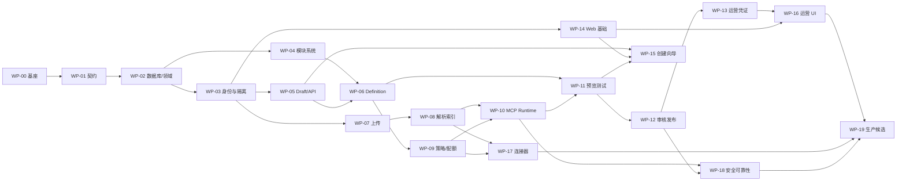

# 模块化 MCP 构建套件 Codex 5.4 技术开发工作包

> 版本：V1.0  
> 日期：2026-09-15  
> 状态：技术专家与研发负责人评审稿  
> 关联方案：`04_模块化MCP构建套件_技术开发方案.md`

---

## 1. 工作包设计目标

本文件把 P0 拆成可由单个 Codex 5.4 编码任务自主完成、可独立验证、可安全回滚的工作包。工作包不是人员排期：实际工期取决于团队并行度、基础设施审批和评审等待时间。

官方 OpenAI 文档把 GPT-5.4 定位为适合代码密集和多步代理任务的通用模型，并说明其可处理仓库模式、多文件变更、长上下文、工具调用和 apply patch。拆包因此允许一个任务跨少量相关文件完成“读—改—测—修复”，但仍要求明确目录所有权、契约、成功标准和停止条件。

能力依据：[GPT-5.4 模型页](https://developers.openai.com/api/docs/models/gpt-5.4)、[GPT-5.4 模型使用指南](https://developers.openai.com/api/docs/guides/latest-model?model=gpt-5.4)。模型能力是拆包输入，不替代本项目的代码评审、安全审批和发布门禁。

### 1.1 自主工作包硬约束

每个工作包必须满足：

1. 一个主要业务结果，通常只修改一个应用和不超过三个共享包；
2. 前置契约已经合并，或工作包内先以契约测试冻结；
3. 输入列出必读文件，禁止让代理自行猜测产品规则；
4. 明确允许修改和禁止修改的目录；
5. 验收命令可在本地无人工点击执行；
6. 不要求真实生产 Secret、生产数据、付费账户或人工审批；
7. 外部依赖使用 Testcontainers、模拟服务或录制的合成 fixture；
8. 数据库迁移向前兼容，有 rollback/补偿说明；
9. 完成时提交变更摘要、测试证据、风险和未决项；
10. 发现契约冲突、安全边界变化或范围扩大时停止，不擅自作产品决定。

### 1.2 Codex 5.4 执行设置建议

| 工作类型 | 建议 reasoning effort | 单任务上下文 | 说明 |
| --- | --- | --- | --- |
| 脚手架、CRUD、UI 状态 | medium | 相关目录 + 契约 + 测试 | 平衡质量与速度 |
| 状态机、并发、策略、安全 | high | 再加入 ADR/威胁模型 | 需要更严格推理 |
| 复杂故障、跨包重构 | high/xhigh | 只在评测证明有收益时提升 | 先缩小问题再增加计算量 |
| 文案、fixture、简单 schema | low/medium | 单文件或单包 | 保持输出简洁 |

单任务不应把整个仓库无差别塞入 prompt。即使模型支持长上下文，也应提供仓库地图、必读文件和精准检索路径，以降低错误关联和成本。

## 2. 仓库级代理契约

在 WP-00 中创建根 `AGENTS.md`，至少包含：

- 产品 P0 只读边界和禁止能力；
- 领域术语与 Draft/Candidate/Version 不可变规则；
- 分层依赖方向和目录所有权；
- workspace/project/environment 过滤要求；
- Secret、正文、URL 参数和查询内容禁止入日志；
- 所有写接口的幂等和并发控制要求；
- Definition canonicalization 不得私自变更；
- 统一 lint/typecheck/test/build 命令；
- 只能使用 `apply_patch` 类可审查变更；
- 禁止顺手升级依赖、重排无关代码或修改既有迁移；
- 何时必须停止并请求架构/安全决策。

每个应用目录可以添加更具体的 `AGENTS.md`，但不能放宽根约束。

## 3. 工作包依赖图



建议并行波次：

- Wave 0：WP-00；
- Wave 1：WP-01；
- Wave 2：WP-02；
- Wave 3：WP-03、WP-04；
- Wave 4：WP-05、WP-07、WP-14；
- Wave 5：WP-06、WP-08；
- Wave 6：WP-09、WP-11；
- Wave 7：WP-10、WP-15；
- Wave 8：WP-12、WP-17；
- Wave 9：WP-13、WP-16、WP-18；
- Wave 10：WP-19。

同一波次只在各工作包使用独立 worktree/分支且不修改同一共享契约时并行。`packages/contracts`、数据库迁移和根配置采用串行合并队列。

## 4. 工作包总表

| ID | 名称 | 主要输出 | 复杂度 | 人工门禁 |
| --- | --- | --- | --- | --- |
| WP-00 | 工程基座 | monorepo、CI、本地环境、AGENTS.md | M | 架构评审 |
| WP-01 | 契约与错误模型 | OpenAPI、JSON Schema、事件、错误码 | H | API 评审 |
| WP-02 | 领域与数据库 | 聚合、状态机、schema、RLS、outbox | H | 数据评审 |
| WP-03 | 身份、RBAC、租户隔离 | ActorContext、成员权限、step-up 接口 | H | 安全评审 |
| WP-04 | 模块目录与解析器 | manifest、resolver、签名/阻止接口 | H | 供应链评审 |
| WP-05 | Draft、模板和目标 API | autosave、revision、模板、目标 | M | 产品验收 |
| WP-06 | Definition 编译与差异 | canonicalize、hash、effective limits、diff | H | 架构评审 |
| WP-07 | 上传与 DataVersion | multipart、quarantine、工作流状态 | H | 安全评审 |
| WP-08 | 解析、规范化和索引 | TXT/PDF→七格式、chunk、OpenSearch | H | 数据质量评审 |
| WP-09 | 策略、配额和输出保护 | OPA port、quota、redaction/limits | H | 安全评审 |
| WP-10 | MCP Gateway 与内置能力 | Tools/Resources/Prompts、request pipeline | H | 协议评审 |
| WP-11 | 三视角预览与测试中心 | preview、test runner、固定证据 | H | 测试评审 |
| WP-12 | 审核、制品、部署 | Candidate、签名制品、摘要核验 | H | 发布评审 |
| WP-13 | 凭证与运营后端 | API Key、OAuth、trace、version/actions | H | 安全/运维评审 |
| WP-14 | Web Shell 与设计系统 | 导航、状态组件、a11y、API client | M | 设计评审 |
| WP-15 | 七步创建向导 | UI-06～26、自动保存、恢复、冲突 | H | 产品/设计验收 |
| WP-16 | 运营 UI | UI-27～40、凭证、追踪、版本、高影响操作 | H | 运维/设计验收 |
| WP-17 | 三类只读连接器 | HTTP、S3、数据库 | H | 安全评审 |
| WP-18 | 安全、可靠性与性能加固 | 安全套件、故障注入、k6、runbook | H | 上线门禁 |
| WP-19 | 生产候选与试点 | Helm/Terraform、灾备、E2E、证据包 | H | Go/No-Go |

## 5. 详细工作包

### WP-00 工程基座与开发体验

**目标**：建立所有后续任务可重复使用的一键开发、测试和 CI 基线。

**前置**：技术方案的架构边界获原则通过。

**允许修改**：根配置、`infra/compose`、`scripts`、空应用/包脚手架、CI、`AGENTS.md`。  
**禁止修改**：业务实现和真实云环境。

**任务**：

- 创建 pnpm workspace/Turborepo 或 Nx，统一 TypeScript、ESLint、Prettier、Vitest；
- 建立 `web/control-api/mcp-gateway/workers` 空应用和共享包边界；
- Docker Compose 启动 PostgreSQL、Redis、MinIO、OpenSearch、Temporal、OPA、OTel；
- 提供 `.env.example`，仅使用开发假凭证；
- 提供 `make bootstrap/up/down/reset/check/test` 或等价命令；
- CI 执行格式、lint、typecheck、unit、build、secret scan；
- 写根 `AGENTS.md` 和架构测试，防止 domain 导入基础设施。

**验收**：全新机器从 clone 到 smoke test 不超过 20 分钟；`./scripts/check-dev-env.sh` 通过；`docker compose up -d` 后全部健康；任意包能运行测试；CI 无 Secret。

**建议命令**：`pnpm lint && pnpm typecheck && pnpm test && pnpm build`。

### WP-01 契约、Schema 与错误模型

**目标**：先冻结跨包接口，允许后续工作包并行。

**前置**：WP-00。  
**允许修改**：`packages/contracts`、`docs/api`、契约测试。  
**禁止修改**：业务实现、数据库迁移。

**任务**：

- OpenAPI 3.1 覆盖 Workspace、Project、Draft、Data、Module、Preview、Test、Review、Deployment、Credential、Operations；
- JSON Schema 定义 Service Definition、module manifest、PolicyInput/Decision、错误信封；
- 定义 MCP P0 五个 Tool、三类 Resource Template、三个 Prompt；
- 建立领域事件信封、事件版本和兼容规则；
- 生成 TypeScript 类型但把 schema 作为事实源；
- 建立错误码目录、HTTP/MCP 映射和无权不泄露规则；
- 添加 breaking-change 检测、示例校验和 schema fixture。

**验收**：所有 schema 示例可验证；生成文件无 diff；破坏字段或错误码会使测试失败；PRD P0 API 能力无空白。

### WP-02 领域模型、状态机与数据库基线

**目标**：实现纯领域规则、持久化骨架、租户列、审计/outbox/idempotency。

**前置**：WP-01。  
**允许修改**：`packages/domain`、`packages/database`、迁移、领域/DB 集成测试。  
**禁止修改**：HTTP、UI、MCP 运行时。

**任务**：

- 实现 PRD 的 Draft/Candidate/Version/Deployment/Upload/Credential/Module 状态机；
- 建表、索引、外键、唯一约束、soft delete/retention 字段；
- 每个租户表强制 workspace/project 归属，启用 RLS；
- 实现 repository 端口、事务边界、outbox 和 idempotency records；
- 用数据库约束阻止非法版本覆盖和非法状态回退；
- 生成合成 seed 和两 Workspace 同名资源 fixture。

**验收**：状态转换表全覆盖；跨租户 SQL 集成测试为零结果；同幂等键并发只产生一个事实；迁移从空库和上一基线均成功。

### WP-03 身份、RBAC 与租户隔离

**目标**：形成每个请求都可验证的 ActorContext 和最小权限访问入口。

**前置**：WP-02。  
**允许修改**：`packages/authz`、`apps/control-api` 的身份/Workspace/Project 模块、RLS session adapter。  
**禁止修改**：业务域的授权快捷逻辑、生产 IdP 配置。

**任务**：

- OIDC token 验证和本地身份模拟器；
- Workspace/Project 角色叠加取更严格结果；
- 成员邀请、角色变更、会话终止 API；
- 高影响操作 step-up 接口和新鲜认证时间检查；
- 数据库事务注入 workspace/actor context；
- 审计身份和角色变化；
- 建立所有控制面 endpoint 的默认拒绝中间件。

**验收**：跨 Workspace、越角色、过期 token、角色即时收紧和 step-up 负例通过；响应不泄露对象存在性。

### WP-04 模块目录、清单和依赖解析

**目标**：实现 Source/Capability/Output/Prompt 模块的安全组合和精确版本锁定。

**前置**：WP-02；WP-01 module schema。  
**允许修改**：`packages/module-sdk`、`packages/module-builtins`、控制面 module catalog。  
**禁止修改**：自定义代码运行、运行时网络权限。

**任务**：

- manifest 加载、schema 验证、SemVer、依赖闭包、循环/冲突检测；
- 一键补齐和替代方案的纯计算接口；
- 审核/approved/deprecated/blocked 状态和影响查询；
- artifact digest 与签名验证端口，开发使用测试信任根；
- 首批 P0 模块清单与配置 schema；
- resolver 结果必须输出完整解释和阻断位置。

**验收**：缺依赖、循环、冲突、不兼容、未审核、签名错误、blocked 均稳定拒绝；相同输入输出顺序和摘要稳定。

### WP-05 Draft、模板与业务目标 API

**目标**：支持三种创建方式、七步 Draft 骨架、目标配置、自动保存和冲突恢复。

**前置**：WP-03、WP-04 契约可用。  
**允许修改**：`control-api` draft/template/goal，相关 domain/repository。  
**禁止修改**：Definition 编译、上传解析。

**任务**：

- 空白、模板、复制版本创建独立 Draft；
- 三个 P0 模板和平台强制安全默认值；
- 目标/受众/禁止用途/语言/能力校验；
- revision/ETag 自动保存、服务端确认时间、冲突 diff；
- 步骤完成与草稿保存分离；
- 变更后标记哪些 preview/test 失效。

**验收**：刷新恢复、并发修改冲突、不复制凭证、禁用 P0 写能力、模板结果可解释均通过。

### WP-06 Definition 编译、摘要和版本差异

**目标**：把固定 Draft revision 编译成唯一、可追踪、不可变的 Service Definition。

**前置**：WP-04、WP-05。  
**允许修改**：`packages/definition`、Definition application service、fixture/tests。  
**禁止修改**：部署和运行时。

**任务**：

- schema/domain/module/策略引用/数据版本分层校验；
- 平台/项目/模块/用户值的最严格值纯函数；
- compile Tools/Resources/Prompts 和来源映射；
- canonical JSON、SHA-256、builder version；
- 高风险分类和分组 diff；
- immutable repository 和重复编译去重。

**验收**：属性顺序不影响 digest；语义变化影响 digest；相同输入 bit-for-bit 相同；放宽范围被标记高风险；空字段交集阻断。

### WP-07 分片上传、隔离区与 DataVersion 工作流

**目标**：完成可恢复的多文件上传状态机和隔离处理入口。

**前置**：WP-03、WP-02；Temporal 基座。  
**允许修改**：data API、upload workflow、S3 adapter、上传测试。  
**禁止修改**：具体格式解析器、生产扫描厂商集成。

**任务**：

- multipart create/sign/complete/abort、checksum 和过期恢复；
- 单文件进度、最多文件/大小/草稿总量限制；
- quarantine bucket、扫描端口和开发 mock scanner；
- DataVersion 和 job 状态、进度、取消、失败项重试；
- 部分成功的替换/排除/确认语义；
- 删除影响分析和已发布依赖保护。

**验收**：中断续传不重复成功分片；重复 complete 幂等；恶意/类型不符进入隔离；部分失败未经确认不能 completed。

### WP-08 解析、规范化、切块与索引

**目标**：将七类文件变成稳定、可追踪、可检索的规范化数据版本。

**前置**：WP-07。  
**允许修改**：parser worker、normalization/chunking、OpenSearch adapter、fixtures。  
**禁止修改**：任意宏/脚本执行、OCR（除非另立工作包）。

**分两次自主任务**：

- WP-08A：TXT/MD/PDF 纵向切片；
- WP-08B：DOCX/CSV/XLSX/JSON 和格式一致性。

**任务**：sandbox resource limits、magic-byte 检测、稳定 item/chunk ID、页/表/字段定位错误、敏感预览提示、索引映射、游标和重建命令。

**验收**：固定样例 golden test；重复处理不重复 chunk；杀死 Worker 后恢复；无网络/非 root/只读根验证；索引删除后可重建。

### WP-09 策略、配额与输出保护

**目标**：实现数据面统一的故障关闭保护链。

**前置**：WP-03、WP-06。  
**允许修改**：`packages/authz`、policy adapter/bundle、quota、OutputGuard。  
**禁止修改**：具体 Tool 业务逻辑。

**分两次自主任务**：

- WP-09A：PolicyInput/Decision、OPA adapter、策略情景测试；
- WP-09B：Redis quota/concurrency、字段/长度/响应保护。

**验收**：策略超时/不可解析/不可达均拒绝；限制交集满足单调收紧属性；Redis 故障行为可配置且生产为拒绝；错误也无敏感字段。

### WP-10 MCP Gateway 和内置只读能力

**目标**：用同一 Definition 暴露并执行标准 MCP Tools、Resources 和 Prompts。

**前置**：WP-08、WP-09、WP-06。  
**允许修改**：`apps/mcp-gateway`、`packages/data-access`、内置 capability 实现。  
**禁止修改**：控制面 Draft、直接数据库越过 ScopedDataPort。

**分三次自主任务**：

- WP-10A：协议、认证、初始化/发现、Definition 加载；
- WP-10B：`list_documents`、`get_document_metadata`、`verify_citation`；
- WP-10C：`search_documents`、`read_document_sections`、Resources、Prompts。

**验收**：MCP schema 与 WP-01 完全一致；发现也过滤；opaque ID 猜测无效；客户端参数不能扩大条数/字段/段落；Prompt 不增权；性能有基线。

### WP-11 三视角预览和自动测试中心

**目标**：为固定 Definition 生成三种预览和不可覆盖测试证据。

**前置**：WP-06、WP-10。  
**允许修改**：preview/test application、test worker、test fixtures/API。  
**禁止修改**：Definition 重新编译逻辑、UI。

**任务**：

- Owner/User/MCP Client 三视角共享 previewId/definitionDigest；
- 快速、完整、自定义测试和必测用例 registry；
- 无认证、无权限、越界、超限、撤权、数据异常、漂移等负例；
- 后台进度、单项重跑、历史结果保留；
- 报告只含脱敏引用和安全日志标识；
- 关键 Draft 变化使确认和测试证据失效。

**验收**：三视角 Schema 与运行时一致；缺必测/失败不能提交；单项重跑不覆盖旧结果；报告 digest 不可变。

### WP-12 Candidate、审核、制品和部署

**目标**：把通过完整测试的 Definition 安全提升为已发布版本。

**前置**：WP-11。  
**允许修改**：review/release/deployment 模块、artifact builder/deployer、开发 Helm。  
**禁止修改**：生产云资源、直接跳过审核。

**分两次自主任务**：

- WP-12A：冻结 Candidate、审核状态/意见/撤回/修订；
- WP-12B：构建/签名/部署/健康/摘要核验和 endpoint 开放。

**验收**：提交后不可改；意见定位 JSON Pointer；缺测试、未审核、摘要不一致、模块 blocked 均强制失败；重试不重复版本/Deployment；失败不接流量。

### WP-13 凭证、版本和运营后端

**目标**：形成发布后的访问与运营闭环。

**前置**：WP-12、WP-09。  
**允许修改**：credential、operations、trace、usage、notification 后端。  
**禁止修改**：真实邮件/短信集成，外部计费。

**分三次自主任务**：

- WP-13A：API Key 创建、一次展示、hash、轮换、撤销；
- WP-13B：OAuth client/PKCE/scopes/token validation；
- WP-13C：服务概览、trace、usage、告警、版本和高影响动作。

**验收**：库中无明文 key；撤销后下一请求拒绝；环境不能跨用；暂停调用、停止新授权、下线版本行为不同且可恢复；trace 不含正文/Secret。

### WP-14 Web Shell、设计系统与可访问性基座

**目标**：实现所有业务页面复用的外壳、组件、状态和 API 客户端。

**前置**：WP-00、WP-01；UI 手册。  
**允许修改**：`apps/web` 基础、`packages/ui`、Storybook/视觉测试。  
**禁止修改**：具体业务向导。

**任务**：导航、Workspace/Project/Environment selector、状态标签、Effective Result、Issue Panel、进度器、diff、影响确认、表单错误、表格、抽屉/modal、语义 tokens、响应式和 a11y。

**验收**：Storybook 覆盖通用状态；axe 无严重问题；键盘/焦点测试通过；1280/1024/768 快照通过；Secret 组件禁止持久化明文。

### WP-15 七步创建向导

**目标**：实现从创建方式到发布成功的 UI-06～UI-26 主链路。

**前置**：WP-05、WP-11、WP-12 API；WP-14。  
**允许修改**：web wizard/preview/test/review/deploy 页面。  
**禁止修改**：后端契约、UI-27 后运营页面。

**分四次自主任务**：

- WP-15A：创建方式、目标、右侧有效结果；
- WP-15B：上传/处理/预览/连接向导；
- WP-15C：模块、依赖、Tools/Resources/Prompts、策略和保护；
- WP-15D：三视角、测试、提交、审核、部署、成功。

**验收**：自动保存/恢复/冲突；所有阻断可定位；后台任务可离开；六条原型链至少 A～D 通过 Playwright；键盘完成主流程。

### WP-16 运营、凭证与管理 UI

**目标**：实现 UI-27～UI-40 的服务运营闭环。

**前置**：WP-13、WP-14。  
**允许修改**：web operations/admin 页面。  
**禁止修改**：后端语义。

**分两次自主任务**：

- WP-16A：API Key/OAuth、服务概览、能力、数据、访问；
- WP-16B：追踪、版本 diff、任务、通知、高影响操作和平台管理。

**验收**：Secret 只显示一次；生产定义只读；trace 脱敏；高影响确认包含影响/恢复/原因；Playwright 覆盖撤权和数据 v2。

### WP-17 只读 HTTP、对象存储和数据库连接器

**目标**：在统一 ScopedDataPort 下接入三类外部数据源。

**前置**：WP-08、WP-09、WP-13 Secret adapter。  
**允许修改**：connector worker、连接器 packages、连接测试 API/fixtures。  
**禁止修改**：任意写方法、任意 SQL、用户可变 host/bucket/prefix。

**每类连接器一个自主任务**：

- WP-17A HTTP：固定 host/path、认证、分页、schema mapping、SSRF 防护；
- WP-17B S3：endpoint/region/bucket/prefix 固定、列表/抽样/对象限制；
- WP-17C DB：首批数据库、只读验证、表/视图/字段 allowlist、参数化过滤、游标。

**验收**：网络/认证/schema 分阶段错误；Secret 不回显；DNS 重绑定/redirect/private IP、prefix escape、SQL 注入负例通过；范围扩大产生新版本。

### WP-18 安全、可靠性和性能加固

**目标**：把各工作包的局部保证提升为系统级发布门禁。

**前置**：WP-10、WP-12、WP-13。  
**允许修改**：`tests/security|performance|e2e`、telemetry、runbooks、小范围修复。  
**禁止修改**：未经 ADR 的架构重写。

**分三次自主任务**：

- WP-18A：跨租户/越权/撤权/SSRF/路径/日志/制品篡改安全套件；
- WP-18B：Worker kill、依赖中断、重复消息、幂等和恢复测试；
- WP-18C：k6 容量模型、P95、配额并发和任务积压。

**验收**：PRD 第 13 节 10 条 E2E 全通过；高/严重漏洞为零；NFR 指标达标或有签字例外；每个告警有 runbook。

### WP-19 生产候选、灾备与试点

**目标**：形成可审计的 Go/No-Go 证据包和首个受控试点。

**前置**：所有 P0 工作包。  
**允许修改**：Helm/Terraform、release pipeline、runbooks、evidence；仅在批准账户部署。  
**禁止修改**：未批准生产资源、真实客户数据导入。

**任务**：多环境隔离、制品提升、签名/SBOM/provenance、备份/PITR/索引重建、回滚、容量、浏览器/MCP 客户端矩阵、试点开关和应急停止。

**验收**：干净环境部署；Definition digest 全链一致；RPO/RTO 演练；安全/性能/E2E 报告；值班和升级路径；架构、安全、产品、运维共同签字。

## 6. 可直接派发的原子任务索引

下表是实际投递给 Codex 5.4 的最小任务单元。一个原子任务原则上控制在一个应用或两个紧密相关共享包内；表中“验证焦点”需要转换为具体命令和 Given/When/Then 用例后再投递。

| 原子包 | 交付边界 | 直接前置 | 验证焦点 |
| --- | --- | --- | --- |
| 00A | workspace、toolchain、空包和依赖边界 | 无 | install/lint/typecheck/build |
| 00B | Compose、healthcheck、`.env.example` | 00A | config/up/wait/smoke |
| 00C | CI、secret scan、根 AGENTS.md | 00A | 本地复现 CI；违规依赖失败 |
| 01A | 公共 ID、分页、错误和异步 Job schema | 00A | schema example/breaking test |
| 01B | Workspace/Project/Draft/Data/Module OpenAPI | 01A | OpenAPI lint/生成无 diff |
| 01C | Preview/Test/Review/Deploy/Credential OpenAPI | 01A | OpenAPI lint/生成无 diff |
| 01D | MCP Definition、manifest、policy、事件 schema | 01A | 正反 fixture 与兼容测试 |
| 02A | domain 基础值对象、版本和状态转换框架 | 01D | 纯单元/非法状态 |
| 02B | tenant/project/data/draft 数据库迁移与 RLS | 02A | 两租户 SQL 负例 |
| 02C | definition/release/access/operations 表与约束 | 02B | 不可变/外键/唯一约束 |
| 02D | repository、transaction、outbox、idempotency | 02C | 并发重复提交 |
| 03A | OIDC 校验、本地 IdP、ActorContext | 02B | 伪造/过期/audience 负例 |
| 03B | Workspace/Project RBAC 与默认拒绝 | 03A | 角色矩阵/即时收紧 |
| 03C | step-up、高影响授权和身份审计 | 03B | 认证新鲜度/审计完整性 |
| 04A | manifest loader、SemVer 和 config schema | 01D、02C | 无效 manifest/稳定序列化 |
| 04B | 依赖闭包、循环、冲突和替代方案 | 04A | 图算法正反例 |
| 04C | module review、签名端口和 blocked 影响 | 04B | 篡改/未审核/blocked |
| 05A | 三种 Draft 创建和三模板 | 03B、04A | 不复制凭证/默认保护 |
| 05B | 目标、步骤校验和结果摘要 | 05A | P0 禁止能力/必填校验 |
| 05C | revision/ETag、自动保存、冲突 diff | 05B、02D | 并发编辑/恢复 |
| 06A | Definition validate/compile 和来源映射 | 04C、05C | 完整/缺失引用 |
| 06B | effective limits 纯函数和属性测试 | 06A | 单调收紧/集合交集 |
| 06C | canonical JSON、digest 和 immutable store | 06B | bit-for-bit/去重 |
| 06D | 分组 diff 和高风险分类 | 06C | 放宽范围全部标高风险 |
| 07A | multipart API、checksum、恢复和过期 | 03B、02D | 断点/重复 complete |
| 07B | quarantine、扫描端口、类型识别 | 07A | 恶意/伪扩展名 |
| 07C | upload workflow、进度、取消、部分成功 | 07B | kill/retry/exclude |
| 08A | parser sandbox 和 TXT/MD 规范化 | 07C | 资源限制/稳定 ID |
| 08B | PDF 解析、页级失败和 chunk | 08A | golden/partial |
| 08C | DOCX/CSV/XLSX/JSON 解析 | 08A | 格式样例/公式不执行 |
| 08D | OpenSearch mapping、过滤、游标和重建 | 08B、08C | tenant filter/重建 |
| 09A | PolicyInput/Decision、OPA adapter/bundle | 03B、06A | unavailable fail-closed |
| 09B | policy scenario evaluator 和决策原因 | 09A | 主体/能力/数据/时间矩阵 |
| 09C | Redis rate/quota/concurrency | 09A | 原子性/故障策略 |
| 09D | OutputGuard、redaction、响应限制 | 06B | 正文/Secret/超限 |
| 10A | MCP transport、认证、Definition loader | 06C、09A | 协议/环境/版本 |
| 10B | 初始化、发现和可见性过滤 | 10A、09B | list 不泄露隐藏能力 |
| 10C | list/metadata/verify capabilities | 08D、10B、09D | opaque ID/引用版本 |
| 10D | search/read/resources/prompts | 10C | 5 段/字段/Prompt 不增权 |
| 11A | 三视角 preview 和失效规则 | 06D、10B | 同 digest/schema |
| 11B | test registry、runner 和后台进度 | 10D、11A | 必测覆盖/可恢复 |
| 11C | 单项重跑、不可变报告和脱敏 | 11B | 历史保留/report digest |
| 12A | Candidate freeze 和审核状态/意见 | 11C、03C | 修改阻断/JSON Pointer |
| 12B | artifact build、SBOM、签名和 digest | 12A、04C | 制品篡改 |
| 12C | deployment workflow、health 和路由开放 | 12B | 失败零流量/幂等 |
| 13A | API Key 生命周期 | 12C、09C | 明文不落库/撤权下一请求 |
| 13B | OAuth client、PKCE、scope 和 token | 12C、09B | issuer/audience/env/scope |
| 13C | usage、trace、metrics 和 service overview | 10D、12C | 脱敏/关联 ID |
| 13D | 版本、数据更新和三类高影响操作 | 13C、03C | 行为差异/恢复/审计 |
| 14A | Web shell、导航、API client 和 session | 01B、03A | route/auth/error |
| 14B | 表单、状态、Issue/Result/Progress 组件 | 14A | Storybook/axe/keyboard |
| 14C | diff、影响确认、表格、响应式 tokens | 14B | 视觉/a11y 快照 |
| 15A | 创建方式和目标 UI | 05B、14B | 实时结果/禁止能力 |
| 15B | 数据上传、处理、预览和连接壳 UI | 07C、14B | 恢复/partial/background |
| 15C | 模块、能力、策略和保护 UI | 06B、09B、14C | 阻断定位/有效值 |
| 15D | 预览、测试、提交、审核、部署 UI | 11C、12C、14C | Playwright 主链路 |
| 16A | API Key/OAuth 和服务概览 UI | 13A、13B、14C | Secret 一次展示 |
| 16B | 能力、数据、访问、追踪和版本 UI | 13C、13D、14C | 只读/脱敏/diff |
| 16C | 任务、通知、平台管理和高影响 UI | 13D、14C | 影响/恢复/原因 |
| 17A | HTTP connector 和 SSRF 套件 | 08D、09A | DNS/redirect/IP/path |
| 17B | S3 connector 和 prefix 套件 | 08D、09A | endpoint/bucket/prefix |
| 17C | DB connector 和参数化查询套件 | 08D、09A | read-only/allowlist/injection |
| 18A | 系统级跨租户、越权、撤权安全 E2E | 13D、17C | PRD 安全负例 |
| 18B | 故障注入、重复投递和恢复 E2E | 12C、13D | worker/dependency failure |
| 18C | k6 容量、P95、积压和配额并发 | 10D、13C | NFR 性能目标 |
| 18D | telemetry dashboard、alert 和 runbook | 18B、18C | 告警可操作/无敏感标签 |
| 19A | Helm/Terraform 和多环境隔离 | 12C、18D | clean deploy/isolation |
| 19B | release promotion、provenance 和回滚 | 19A | digest/签名/rollback |
| 19C | 备份/PITR/索引重建演练 | 19A | RPO/RTO/事实核对 |
| 19D | 全量 E2E、客户端矩阵和 Go/No-Go 包 | 19B、19C | M5 退出证据 |

推荐单个原子包的变更规模为 200～1200 行有效代码、5～30 个相关文件；这是评审启发式而非硬限制。若任务预计超出一个工作日的连续代理执行、需要修改四个以上领域边界，或首次测试反馈暴露两类以上不相关故障，应继续拆分，而不是单纯提高 reasoning effort。

## 7. 每个工作包的标准任务说明模板

将以下内容复制为 Codex 任务，不要只发送工作包标题：

```text
目标结果：<可观察的业务结果>

必须阅读：
- AGENTS.md
- <相关 ADR/合同/PRD 段落>
- <相关 package README>

前置状态：
- 基线 commit: <sha>
- 已冻结契约: <schema/version>
- 可用本地依赖: <列表>

允许修改：<目录/文件>
禁止修改：<目录/能力/依赖>

实现要求：
- <不变量、安全、幂等、兼容要求>

验收标准：
- Given/When/Then 列表
- 必须执行的命令
- 需要保存的测试证据

完成输出：
1. 变更摘要；
2. 文件清单；
3. 测试命令和结果；
4. 安全/兼容影响；
5. 未决项。

停止条件：
- 契约需要破坏性修改；
- 需要生产 Secret/外部写操作；
- 发现跨租户或关闭式拒绝规则与现状冲突；
- 工作超出允许目录或需要架构决策。
```

## 8. 合并与评审规则

### 8.1 分支与 worktree

- 一个工作包一个分支和 worktree；子包使用 `wp-10a/...` 形式；
- 基线 commit、契约版本和数据库 migration head 写入任务；
- 不允许两个并行任务创建同一迁移序号或修改同一生成文件；
- 共享契约先单独合并，再 rebase 后续实现；
- 合并后删除临时 worktree，分支按团队策略保留。

### 8.2 PR 门禁

```text
format -> lint -> typecheck -> unit -> contract -> integration
-> security fast suite -> build -> affected E2E -> artifact scan
```

高风险包增加人工门禁：WP-02 数据、WP-03/09/13/17 安全、WP-06/12 架构、WP-18/19 上线委员会。代理不能自我批准这些门禁。

### 8.3 失败与回滚

- 代码回滚：revert 工作包 commit，不复用已撤销迁移号；
- 数据库：优先 forward fix；破坏性迁移必须 expand/contract；
- Definition/Module：发布新版本或阻止版本，不修改已发布事实；
- 部署：路由切回已签名 digest；
- 凭证：轮换和撤销不可通过数据库恢复明文，需重新创建。

## 9. 开发环境要求

### 9.1 支持平台

- macOS 13+（Apple Silicon/Intel）或主流 64-bit Linux；Windows 使用 WSL2；
- 推荐 8 核 CPU、32 GB RAM、可用磁盘 80 GB；最低 4 核、16 GB、40 GB，仅适合单组件开发；
- Docker 分配建议 6 CPU、16 GB RAM；OpenSearch 本地至少预留 4 GB；
- 可访问组织代码源和允许的镜像/包代理；生产数据不得进入本地。

### 9.2 必需工具

| 工具 | 最低基线 | 用途 |
| --- | --- | --- |
| Git | 2.43 | 分支/worktree/审查 |
| Node.js | 22.x LTS | Web/API/Worker |
| pnpm | 9+ | 固定包管理器；Corepack 可选 |
| Docker Engine/Desktop | 27+ | 本地依赖和集成测试 |
| Docker Compose | v2.29+ | 本地编排 |
| GNU Make | 3.81+ | 统一命令入口；Makefile 保持 macOS 兼容 |
| jq | 1.7+ | smoke/契约脚本 |
| curl | 8+ | health/API 检查 |
| OpenSSL | 3+ 推荐 | 开发证书/摘要 |
| Python | 3.11+ | 安全/契约/运维辅助脚本 |

Kubernetes、Helm、Terraform、k6 仅 WP-12/18/19 强制；日常 Web/API 开发可选。版本基线是本项目的兼容下限，不代表“最新版本”；最终由 WP-00 的 toolchain 文件和 lockfile 冻结。

### 9.3 本地基础设施

Docker Compose 应提供：PostgreSQL、Redis、MinIO、OpenSearch、Temporal、OPA、OpenTelemetry Collector，以及可选 Prometheus/Grafana。默认只绑定 loopback；使用合成数据和开发密钥；`infra/compose` 中的端口必须可配置以支持并行 worktree。

### 9.4 必需环境变量

`.env.example` 只列变量名和安全开发默认值：

```text
APP_ENV=development
DATABASE_URL=
REDIS_URL=
S3_ENDPOINT=
S3_BUCKET_QUARANTINE=
S3_BUCKET_DATA=
OPENSEARCH_URL=
TEMPORAL_ADDRESS=
OPA_URL=
OTEL_EXPORTER_OTLP_ENDPOINT=
DEV_OIDC_ISSUER=
DEV_SIGNING_KEY_PATH=
DEV_SECRET_MASTER_KEY=
```

真实云 Secret 不写 `.env`；CI 使用短期工作负载身份。`.env*`、私钥、导出数据库、上传样本目录必须在 secret scan 和 `.gitignore` 中双重保护。

## 10. 开发环境检查命令

仓库提供可执行脚本：

```bash
./scripts/check-dev-env.sh
```

严格模式（同时检查可选的发布工具）：

```bash
CHECK_OPTIONAL=1 ./scripts/check-dev-env.sh
```

基础工具的手工检查：

```bash
git --version
node --version
corepack --version
pnpm --version
docker version
docker compose version
make --version
jq --version
curl --version
openssl version
python3 --version
```

容器和主机资源检查：

```bash
docker info
docker run --rm hello-world
docker system df
df -h .
```

项目基座建立后的完整检查：

```bash
corepack enable
pnpm install --frozen-lockfile
docker compose -f infra/compose/docker-compose.yml config --quiet
docker compose -f infra/compose/docker-compose.yml up -d --wait
pnpm db:migrate
pnpm lint
pnpm typecheck
pnpm test
pnpm test:contract
pnpm test:integration
pnpm build
pnpm test:smoke
```

上述项目命令由 WP-00 建立；在 WP-00 完成前，环境检查脚本只验证主机工具。

## 11. 里程碑退出证据

| 里程碑 | 必需证据 |
| --- | --- |
| M0 | 环境检查、CI 绿灯、架构测试、空库迁移、smoke |
| M1 | TXT/PDF 纵向 E2E、API Key 调用、越权负例、digest 证据 |
| M2 | 七格式 golden、搜索/读取性能、三视角一致、输出保护 |
| M3 | 三连接器范围和 SSRF/注入证据、Secret 扫描 |
| M4 | OAuth、撤权下一请求、三类高影响动作、运营仪表盘 |
| M5 | 全量 E2E、安全报告、SBOM/签名、灾备/回滚、Go/No-Go |

## 12. 工作包完成定义

工作包只有在代码、测试、契约、必要文档和迁移一起完成，所有验收命令通过，未越过目录/安全边界，并由相应人工门禁签字后才算完成。Codex 输出“已实现”但没有可复现测试证据，不计为完成；因外部审批或产品决策停止时，应记录精确 blocker 和继续所需输入，不用占位实现绕过。
